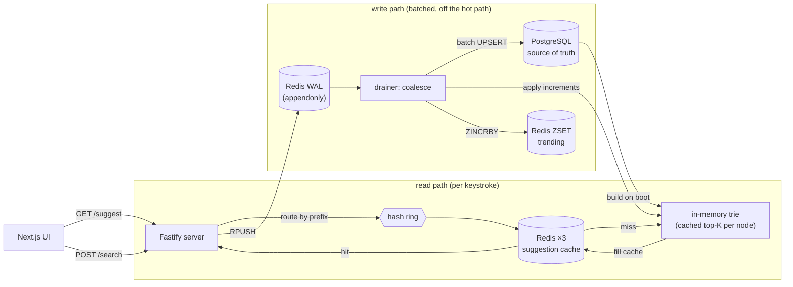

# typeahead-search

A search-autocomplete service: prefix suggestions ranked by popularity, served
from a **distributed cache (consistent hashing)** sitting in front of an
**in-memory trie**, with submitted searches **written back to Postgres in
batches** through a durable write-ahead log. Recency-aware ranking and a live
trending leaderboard on top.


Design decisions and trade-offs live in **[docs/DESIGN.md](docs/DESIGN.md)**.
The benchmark numbers are in **[docs/PERFORMANCE.md](docs/PERFORMANCE.md)**.

## Highlights

- **Reads are O(prefix length).** Each trie node caches the top-K completions of
  its subtree, so a keystroke is a prefix walk + a list read — no subtree scan,
  and no Postgres on the read path.
- **Distributed cache, consistent hashing.** Three Redis nodes, a MurmurHash3 ring
  with virtual nodes, write-around + short jittered TTL. `~99%` hit rate on a Zipf
  read mix.
- **Durable batched writes.** `POST /search` appends to a Redis WAL and returns;
  a drainer coalesces and batch-upserts (`~7.6×` fewer rows, `~1800×` fewer
  transactions). The WAL is appendonly, so a crash replays instead of losing
  counts.
- **Decaying trending leaderboard** in a Redis sorted set — reads never touch the
  DB.
- **Live UI** (Next.js) showing per-query cache hit/miss + node, the trending
  board, and a metrics strip, all updating as you type.

## Stack

| Layer | Tech |
|---|---|
| Backend | TypeScript · Fastify |
| Cache | Redis ×3 (consistent hashing, `volatile-lru`) |
| Store | PostgreSQL |
| Frontend | Next.js · React · Tailwind |

## Architecture



## Run

```bash
docker compose up -d          # postgres (5433) + 3 redis (7001-7003)
cp .env.example .env
pnpm install

pnpm --filter @ta/server load     # load ~150k synthetic queries (no download)
pnpm --filter @ta/server start    # backend on http://localhost:8080
pnpm --filter @ta/web dev         # UI on http://localhost:3000
```

Then open <http://localhost:3000> and start typing.


## Dataset

`pnpm --filter @ta/server load` generates ~150k queries with **Zipf-distributed
counts** (a few queries dominate, like real search traffic — which is what makes
the cache hit rate high). No download needed.

To use a **real query log** instead, point the loader at a CSV/TSV; it derives
counts by aggregation (`COUNT(*)` per normalized query):

```bash
pnpm --filter @ta/server load --file path/to/queries.csv --top 1000000 --min-count 2
```

## API

| Method | Endpoint | Description |
|---|---|---|
| GET | `/suggest?q=<prefix>&mode=count\|recency` | Top-10 prefix matches. `count` = all-time, `recency` = popularity + decay. |
| POST | `/search` `{"query":"..."}` | Acks `Searched`; buffers the count (write-back). |
| GET | `/trending?n=10` | Decaying trending leaderboard. |
| GET | `/cache/debug?prefix=<p>` | Which node owns the prefix + live HIT/MISS. |
| GET | `/cache/ring?sample=N` | Key distribution across the nodes. |
| GET | `/metrics` | Hit rate, DB write counts + reduction, p50/p95/p99 latency. |

```bash
pnpm --filter @ta/server bench    # drive load and print the performance report
pnpm --filter @ta/server test     # trie / ranking / hash-ring / metrics unit tests
```

## Layout

```
apps/
  server/   Fastify backend
    src/lib/    trie · hashRing · cache · writeBuffer · trending · store · ranking · metrics
    src/routes/ suggest · search · trending · cache · metrics
    scripts/    loadDataset · benchmark
  web/      Next.js UI
docs/       DESIGN.md · PERFORMANCE.md
```
