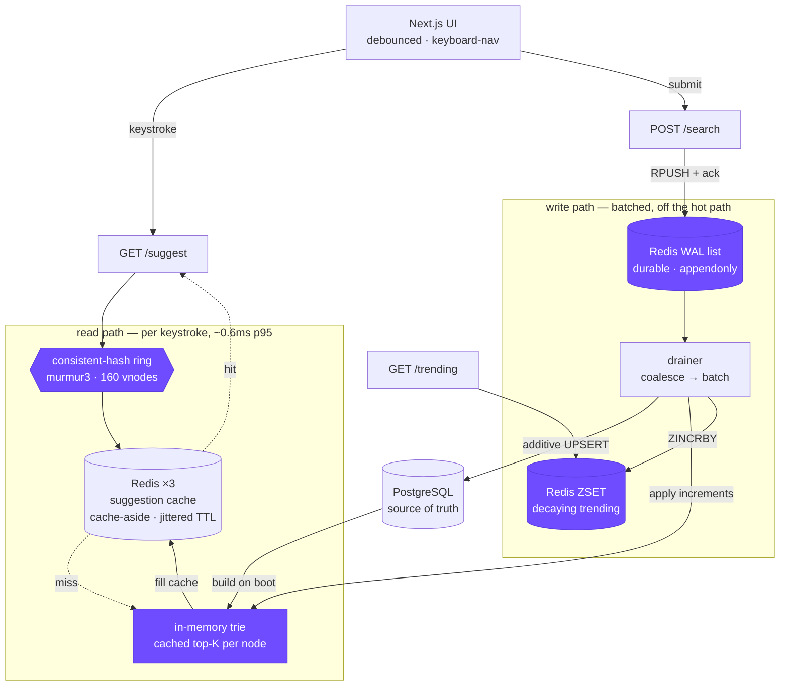
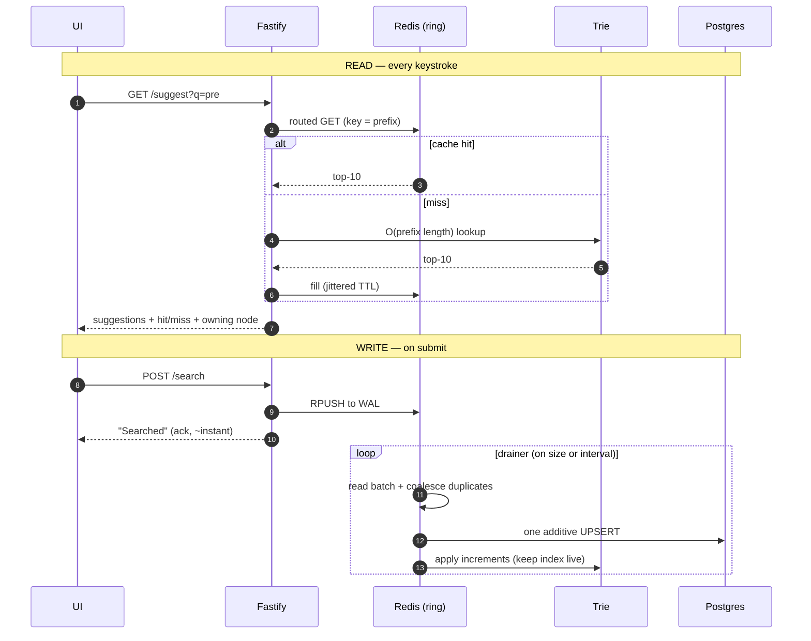
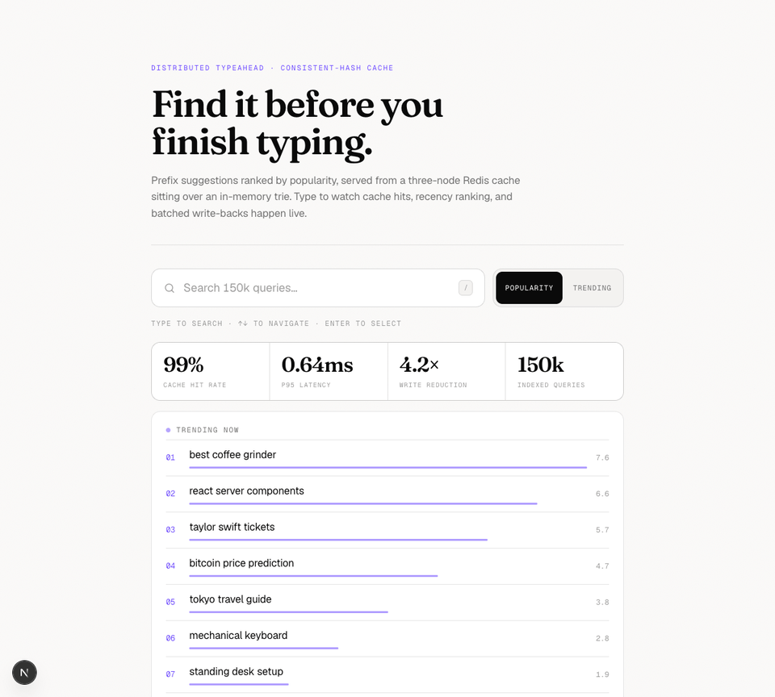

# typeahead-search

> Type a few letters, get the most popular searches back in well under a millisecond. Prefix suggestions served from a **distributed cache (consistent hashing)** over an **in-memory trie**, with searches **batched back to Postgres** through a durable write-ahead log — plus recency-aware ranking and a live trending leaderboard.


---

## Architecture

Two workloads share one dataset: **reads** (suggestions, on every keystroke) and
**writes** (a count bump on every submitted search). Reads dominate ~5–10:1, and
suggestion data tolerates being slightly stale — so the whole design makes reads
cheap and keeps writes off the hot path. The four pieces in **purple** are where
the interesting decisions live.



### Request lifecycle



Full reasoning — every decision and the alternatives I rejected — is in
**[docs/DESIGN.md](docs/DESIGN.md)**. Benchmark numbers in
**[docs/PERFORMANCE.md](docs/PERFORMANCE.md)**. A one-page write-up of all of it
is in **[docs/Project-Report.pdf](docs/Project-Report.pdf)**.

---

## See it



As you type, each result shows whether it came from **cache or the trie** and
which node served it; the metrics strip and the decaying **trending** board
update live.

---

## What it does

| Area | How |
|---|---|
| **Prefix suggestions, ranked by popularity** | In-memory trie where every node caches the top-K of its subtree → a keystroke is an `O(prefix length)` walk, **no DFS, no DB**. |
| **Distributed cache via consistent hashing** | 3 Redis nodes, a MurmurHash3 ring with 160 virtual nodes. Cache-aside reads, write-around + short **jittered TTL** for invalidation, `volatile-lru` eviction. |
| **Trending (recency-aware)** | A **decaying Redis sorted set** — each flush bumps scores, a sweep ages them by a half-life, reads are one `ZREVRANGE` that never touches Postgres. |
| **Batch writes** | `POST /search` appends to a **durable Redis WAL** and returns; a drainer coalesces and batch-upserts → **~7.6× fewer rows, ~1800× fewer transactions**, and an un-flushed window survives a crash. |
| **Observability** | `/metrics` (hit rate, p50/p95/p99, write reduction), `/cache/debug` (per-prefix routing + live HIT/MISS), `/cache/ring` (key distribution). |
| **UI** | Next.js — debounced suggestions, keyboard nav, prefix highlight, popularity/trending toggle, live cache + metrics readouts. |

---

## Design decisions (the short version)

| Topic | Decision | Rejected |
|---|---|---|
| Serving | trie + per-node cached top-K (`O(prefix)`) | DB `LIKE` per keystroke; DFS per read |
| Routing | consistent hashing, murmur3 + 160 vnodes | round-robin (no locality); `% N` (mass remap); FNV-1a (clustered) |
| Eviction | `volatile-lru` (only TTL'd keys) | `allkeys-lru` (would evict the WAL + trending) |
| Invalidation | write-around + short **jittered** TTL | write-through (costly); targeted (complex) |
| Writes | durable WAL + coalesced batch upsert | in-memory buffer (loses a window on crash) |
| Trending | decaying Redis sorted set | `ORDER BY recent_score` scan on Postgres |
| Consistency | eventual / PA-EL | strong (latency + availability cost) |

Each row is unpacked with the "why" in [docs/DESIGN.md](docs/DESIGN.md).

---

## Performance

Single laptop, Docker stack, 150k-query Zipf dataset (`pnpm bench`):

| Metric | Value |
|---|---|
| `/suggest` server latency | **p50 0.38ms · p95 0.65ms · p99 0.84ms** |
| Cache hit rate (Zipf reads) | **99.4%** (7948 / 52) |
| DB reads on the suggest path | **0** |
| Write reduction (20k searches) | **7.6× fewer rows · ~1800× fewer transactions** |
| Ring balance (6k keys / 3 nodes) | 1943 / 1883 / 2174 (within ~15%) |
| Trie build (150k queries) | ~350ms |


---

## Run

```bash
docker compose up -d                       # postgres :5433 + 3 redis :7001-7003
cp .env.example .env
pnpm install

pnpm --filter @ta/server load              # ~150k synthetic Zipf queries (no download)
pnpm --filter @ta/server start             # backend → http://localhost:8080
pnpm --filter @ta/web dev                  # UI      → http://localhost:3000
```

```bash
pnpm --filter @ta/server bench             # the performance report above
pnpm --filter @ta/server test              # trie · ranking · hash-ring · metrics tests
```

### Dataset

`load` generates ~150k queries with **Zipf-distributed counts** (a few queries
dominate, like real traffic — which is what makes the cache hit rate high). To
use a **real query log** instead, the loader derives counts by aggregation:

```bash
pnpm --filter @ta/server load --file queries.csv --top 1000000 --min-count 2
```

---

## API

| Method | Endpoint | Description |
|---|---|---|
| GET | `/suggest?q=<prefix>&mode=count\|recency` | Top-10 matches. `count` = all-time, `recency` = popularity + decay. |
| POST | `/search` `{"query":"..."}` | Acks `Searched`; buffers the count (write-back). |
| GET | `/trending?n=10` | Decaying trending leaderboard. |
| GET | `/cache/debug?prefix=<p>` | Which node owns the prefix + live HIT/MISS. |
| GET | `/cache/ring?sample=N` | Key distribution across the nodes. |
| GET | `/metrics` | Hit rate, write reduction, p50/p95/p99 latency. |

---

## Project layout

```
apps/
  server/                       Fastify backend
    src/lib/                    trie · hashRing · cache · writeBuffer · trending
                                · store · ranking · metrics
    src/routes/                 suggest · search · trending · cache · metrics
    scripts/                    loadDataset · benchmark
  web/                          Next.js UI
docs/                           DESIGN.md · PERFORMANCE.md
docker-compose.yml              postgres + 3 redis (volatile-lru, appendonly)
```

Unit tests cover the trie (count + recency + incremental updates), the hash ring
(determinism, balance, minimal remap on node removal), ranking decay, and the
latency percentiles: `pnpm --filter @ta/server test`.
